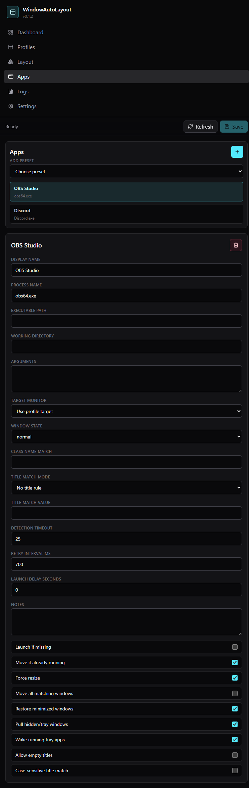

<p align="center">
  
</p>

<h1 align="center">WindowAutoLayout</h1>

<p align="center">
  A quiet Windows tray app for putting OBS, Discord, browsers, and streaming tools back exactly where they belong.
</p>

<p align="center">
  <a href="https://github.com/Riqqqque/WindowAutoLayout/releases/latest"></a>
  <a href="https://github.com/Riqqqque/WindowAutoLayout/actions/workflows/release.yml"></a>
  
  
</p>



## What It Does

WindowAutoLayout saves a profile of app windows, monitor targets, and bounds, then restores that workspace from the app, tray menu, startup, or hotkey. It is meant for everyday Windows setups where the same apps need to land in the same places without running a full tiling window manager.

Highlights:

- Detects connected monitors, including negative virtual-screen coordinates.
- Finds top-level windows with title, class name, process name, PID, bounds, and executable path when Windows exposes it.
- Saves window positions relative to the chosen monitor, so layouts survive monitor offsets better.
- Restores profiles by launching missing apps, waiting for real matching windows, and moving/resizing them with Win32 APIs.
- Pulls minimized or hidden tray windows forward before deciding an app is missing.
- Wakes running tray apps that have no top-level window yet, which covers OBS sitting in the tray for Replay Buffer.
- Supports editable app presets, multiple profiles, startup restore, temporary layout locking, tray restore, logs, and a global hotkey.
- Stores config and logs locally as JSON. No telemetry, accounts, analytics, or background network calls.

## Download

Grab the newest installer from [GitHub Releases](https://github.com/Riqqqque/WindowAutoLayout/releases/latest).

Release builds publish:

- `WindowAutoLayout_<version>_x64-setup.exe`
- `WindowAutoLayout_<version>_x64_en-US.msi`
- `.sha256` checksums for the Windows installers

## Build From Source

Requirements:

- Windows 11
- Node.js 20 or newer
- Rust stable with the MSVC toolchain
- Microsoft WebView2 Runtime

```powershell
npm install
npm run check
cd src-tauri
cargo test
cd ..
npm run desktop:build
```

Development:

```powershell
npm run desktop:dev
```

Install or update this PC from the newest local bundle:

```powershell
npm run desktop:install
```

The install helper rebuilds when needed, runs the newest WindowAutoLayout installer, verifies the Windows uninstall entry, finds the installed exe, and smoke-launches it.

## Using It

1. Open WindowAutoLayout.
2. Pick a default monitor in Settings or a target monitor on a profile.
3. Add apps in the Apps page. Presets are editable.
4. Open and arrange those apps manually.
5. Use Layout to select each real window and save its current layout, or use Dashboard to capture matching configured apps at once.
6. Restore the profile from Dashboard, the tray menu, startup restore, or the hotkey.

The default hotkey is `Ctrl+Alt+L`. Startup restore uses the current user's registry Run key and does not need admin rights.

## OBS And Tray Apps

OBS can stay running in the tray with Replay Buffer on. Keep these enabled for the OBS app entry:

- `Pull hidden/tray windows`
- `Wake running tray apps`

If OBS is already running but Windows reports no main window, WindowAutoLayout asks the existing OBS executable to show itself, waits for the real window, then moves it into the saved layout. Fully missing apps still follow the separate `Launch if missing` setting.

## Matching Rules

Matching checks process name, executable path when available, optional title rules, optional class name, visibility, and whether the window has a title. The restore flow waits and retries so apps with delayed main windows, splash screens, and child processes have time to settle.

Useful notes:

- OBS may take longer while plugins load.
- Discord uses multiple Electron processes and may appear late.
- Steam may show update or login windows before the main window.
- Browser window titles change with active tabs.
- Apps running elevated may block moves from a normal, non-elevated WindowAutoLayout process.

## Project Layout

```text
src/                  React UI
src-tauri/src/        Rust backend
examples/             Sample config
docs/                 Manual and release notes
.github/workflows/    Windows build and release automation
```

## Release Flow

Every version tag matching `v*` builds the Windows bundles and publishes the installer assets to GitHub Releases.

```powershell
git tag v0.1.2
git push origin v0.1.2
```

The workflow validates that the tag matches `package.json`, runs TypeScript and Rust checks, builds the Tauri bundle, generates checksums, uploads the bundle artifact, and publishes the release.

## License

License terms have not been finalized yet. Do not redistribute compiled releases or source archives until a license is selected.
